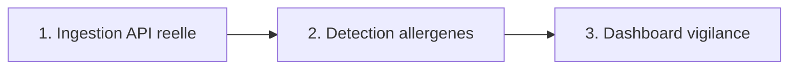

# Playbook : CosmeTech Audit

> Guide opératoire en 4 volets (Définitions / Process / Documentation / Templates).
> Rappel : projet personnel (PoC), données réelles (Open Beauty Facts, licence ODbL), voir [`README.md`](README.md).
> **Dernière mise à jour** : 19/08/2026

---

## 1. Définitions

| Terme | Définition |
|---|---|
| **Open Beauty Facts** | Base collaborative de produits cosmétiques, projet sœur d'Open Food Facts, licence ODbL |
| **INCI** | Nomenclature internationale des ingrédients cosmétiques, utilisée sur toutes les étiquettes en Europe |
| **Allergène de parfum (Annexe III)** | Substance dont la présence doit être déclarée sur l'étiquette au-delà d'un seuil de concentration, règlement (CE) n°1223/2009 |
| **Signal de vigilance** | Une présence détectée dans les ingrédients, pas un verdict de conformité (le seuil de déclaration n'est pas vérifiable depuis une simple liste d'ingrédients) |

---

## 2. Process

1. **Ingestion** (`src/ingest.py`) : appel à l'API publique Open Beauty Facts sur plusieurs catégories, déduplication par code-barres.
2. **Détection** (`src/conformite.py`) : recherche par sous-chaîne insensible à la casse sur le texte INCI brut, contre la liste officielle des 26 allergènes.
3. **Dashboard** (`app.py`) : vue d'ensemble, produits à vigilance, exploration filtrable.

**Point de décision réutilisable** : ne jamais transformer une détection lexicale en verdict réglementaire. Le module documente explicitement sa propre limite dans son docstring plutôt que de la passer sous silence.

---

## 3. Documentation

- [`README.md`](README.md), contexte métier, architecture, chiffres réels du dernier chargement.
- [`PROMPT_LOG.md`](PROMPT_LOG.md), méthode de construction, y compris la vérification de la liste réglementaire sur 2 sources avant de l'implémenter.

---

## 4. Templates réutilisables

- **`src/ingest.py`** : pattern d'agrégation multi-catégories d'une API publique avec déduplication et cache, transposable à toute API de référentiel produit.
- **`src/conformite.py`** : moteur de détection par liste réglementaire sourcée, transposable à toute autre liste officielle (substances interdites, additifs à surveiller) en changeant uniquement la liste et sa source.

**Règle de transposition** : pour un cas réel, remplacer `ingest.py` par l'export produit du client (PLM, ERP) et vérifier que la liste réglementaire dans `conformite.py` reste à jour (l'extension du règlement UE 2023/1545 à ~80 substances entre en application mi-2026).

---

*Gisèle Metouck, Consultante Data Steward & Gouvernance · [GitHub](https://github.com/Kingdmfncr)*
