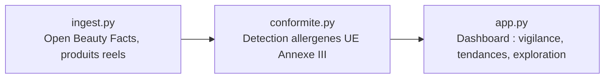

# CosmeTech Audit

⚠️ **Projet personnel (PoC)**, démonstration de méthode. Données **réelles** : produits cosmétiques réels issus d'Open Beauty Facts (projet sœur d'Open Food Facts, licence ouverte ODbL). Aucune marque inventée, aucun ingrédient inventé. Liste réglementaire citée : Annexe III du règlement (CE) n°1223/2009 relatif aux produits cosmétiques (26 allergènes de parfum à déclaration obligatoire).

Je voulais comprendre comment croiser un référentiel produit réel avec une exigence réglementaire précise, sans jamais transformer une simple présence d'ingrédient en un verdict de conformité que la donnée ne permet pas réellement d'établir, alors j'ai construit ce projet.

## Ce que ça résout

Une équipe R&D ou Marketing cosmétique a besoin de repérer rapidement, sur un catalogue produit, la présence d'ingrédients soumis à une obligation de déclaration réglementaire. Ce projet montre comment :
- récupérer un vrai catalogue produit (pas une donnée simulée) via une API publique,
- détecter, sans jugement excessif, la présence d'une liste réglementaire précise et sourcée dans les ingrédients,
- rester honnête sur la limite de la méthode : une présence détectée signale une vérification à faire, jamais un verdict de non-conformité (le seuil de déclaration dépend d'une concentration non lisible dans une simple liste d'ingrédients).

## Architecture



## Fonctionnalités

1. **Ingestion réelle** (`src/ingest.py`) : récupération de produits cosmétiques réels sur 6 catégories (crèmes, shampoings, rouges à lèvres, déodorants, gels douche, soins visage), déduplication par code-barres, mise en cache locale.
2. **Détection réglementaire** (`src/conformite.py`) : recherche des 26 allergènes de l'Annexe III (règlement CE 1223/2009) dans la liste d'ingrédients de chaque produit, sans filtrage silencieux.
3. **Dashboard Streamlit** : vue d'ensemble (allergènes les plus fréquents, répartition par catégorie), liste des produits à vigilance, exploration filtrable par nom ou marque.

Sur le dernier chargement : 125 produits réels analysés, 80 avec au moins un allergène détecté (64%), moyenne de 2,6 allergènes par produit concerné.

## Stack

Python · Requests (API Open Beauty Facts) · Pandas · Streamlit · Plotly · Pytest.

## Lancer en local

```bash
pip install -r requirements.txt
streamlit run app.py
```

## Pour une mission réelle

Cette architecture se transpose à un catalogue produit interne réel (export ERP/PLM) et à une liste réglementaire plus large (extension à venir du règlement UE 2023/1545, environ 80 substances, application prévue mi-2026, non couverte dans ce PoC faute de liste complète vérifiée à date de construction). Contact via [Sovereign Career](https://www.sovereigncareer.fr/freelance/freelance-consultant-data-steward-gisele-metouck).

---

Playbook complet (Définitions/Process/Documentation/Templates) : [`PLAYBOOK.md`](PLAYBOOK.md).
Construit avec l'IA, méthode documentée dans [`PROMPT_LOG.md`](PROMPT_LOG.md).
**Gisèle Metouck**, Consultante Data Steward & Gouvernance · [GitHub](https://github.com/Kingdmfncr)
